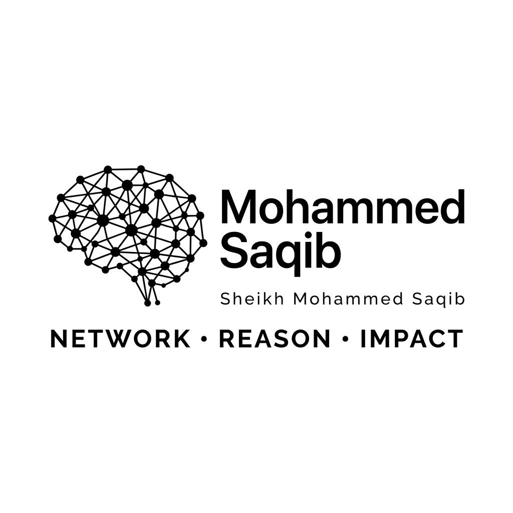
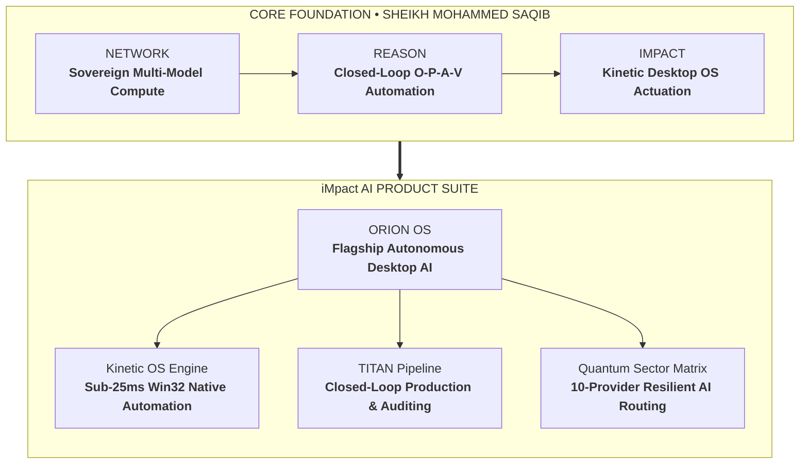

# SHEIKH MOHAMMED SAQIB
### FOUNDER & CHIEF AI SYSTEMS ARCHITECT &bull; iMpact AI

 

> ### **NETWORK &bull; REASON &bull; IMPACT**
> *"The future of computational intelligence will not take place inside browser chat windows. It belongs to ambient, sovereign desktop operating systems capable of perceiving, reasoning, and actuating directly across native environments with kinetic precision."*  
> &mdash; **SHEIKH MOHAMMED SAQIB**

---

## 🌌 Executive Overview

**SHEIKH MOHAMMED SAQIB** is an independent AI systems engineer and the Founder & Chief AI Architect of **[iMpact AI](https://github.com/iMpacts-AI)**.

His engineering discipline bridges high-dimensional cognitive reasoning with native desktop operating system mechanics. While the majority of industry solutions remain constrained within web sandboxes and conversational chat widgets, **SHEIKH MOHAMMED SAQIB** focuses on building production-grade **sovereign autonomous agents**, **kinetic computer-use systems**, and **deterministic safety kernels** that operate directly across the Windows operating system at machine speed.

---

## 📜 What We Are About &bull; The Sovereign Manifesto

At **iMpact AI**, we stand for three foundational pillars of modern autonomous computing:

1. **Escaping the Sandbox:** Artificial intelligence must be liberated from passive chat text bubbles. It must become an active collaborator in your operating system—clicking buttons, navigating terminals, synthesizing telemetry, and operating native desktop software directly.
2. **Deterministic Safety over Hope:** Probabilistic models cannot be trusted to self-police their destructive potential. All autonomous agency must be bounded by deterministic algorithmic filters, human-in-the-loop authorization checkpoints, and instant process-tree emergency stops.
3. **Radical Sovereignty & Multi-Provider Resilience:** No system built for critical operations should ever collapse because a single cloud vendor rate-limited or suffered an outage. Intelligence must be federated, dynamic, and capable of hot-swapping across providers and offline heuristics without disruption.

---

## 💬 Founder Philosophy & Notable Quotes

> ### On the Evolution of Agency:
> *"Confining artificial intelligence to browser chat bubbles is like inventing electricity only to power flashlights. Real agency requires native operating system sovereignty."*  
> &mdash; **SHEIKH MOHAMMED SAQIB**

> ### On Deterministic Safety:
> *"Probabilistic reasoning is the core engine of intelligence, but safety must remain strictly deterministic. Never ask a neural network to audit its own blast radius."*  
> &mdash; **SHEIKH MOHAMMED SAQIB**

> ### On Sovereign Architecture:
> *"The single greatest threat to autonomous AI operations is single-provider dependency. When an API rate-limits or undergoes an outage, your digital nervous system collapses. Multi-sector sovereignty is non-negotiable."*  
> &mdash; **SHEIKH MOHAMMED SAQIB**

---

## ✍️ Featured Essays & Monograph Series

Technical publications authored by **SHEIKH MOHAMMED SAQIB** exploring agentic engineering, desktop actuation, and sovereign systems:

* 📄 **[The Death of the Chatbot Sandbox: Why the Future Belongs to Kinetic Desktop AI](blogs/01-the-death-of-chatbots.md)**  
  *An architectural critique of modern web-based chatbots and a blueprint for sub-25ms Win32 kinetic desktop OS agents.*
  * `Topic: Kinetic Computer-Use & Desktop OS` &bull; `Read Time: 6 min`

* 📄 **[Deterministic Safety Kernels: Governing Autonomous Computer-Use Agents at Machine Speed](blogs/02-deterministic-safety.md)**  
  *Why LLM self-moderation is mathematically flawed, and how to implement zero-trust deterministic risk matrices and process-tree emergency kills.*
  * `Topic: AI Safety & Governance` &bull; `Read Time: 5 min`

* 📄 **[Sovereign Multi-Sector Intelligence: Overcoming the Single-Provider Bottleneck](blogs/03-sovereign-ai-routing.md)**  
  *Designing the Quantum Sector Matrix: 10-provider dynamic failover routing and zero-cloud offline heuristic fallbacks.*
  * `Topic: Distributed Inference & Resilience` &bull; `Read Time: 5 min`

---

## 🏛️ Systems Architecture & Flow

---

## ⚡ Flagship Innovations

### 🌟 [ORION // Autonomous Desktop AI Operating System](https://github.com/iMpacts-AI/ORION)
* **Status:** Flagship Production Platform
* **Overview:** A full-fledged autonomous desktop AI assistant and computer-use agent.
* **Core Capabilities:**
  * **3D Planetary Torus HUD:** Spatial 3D telemetry and status visualization built with Three.js and React 18.
  * **Kinetic Computer-Use:** Native mouse tracking, window management, application execution, and deep filesystem navigation.
  * **Zero-Leakage Security Boundary:** Hardened Chromium sandbox with context isolation separating cloud credentials from UI rendering.
  * **DAG Tool Parallelization:** Multi-tool dependency graphs executing parallel read-only operations and sequential mutating actions.

### 🔬 [iMpact // Sovereign Intelligence Ecosystem](https://github.com/iMpacts-AI/iMpact)
* **Status:** Umbrella Architecture & Foundation
* **Overview:** The sovereign technological ecosystem engineered by **SHEIKH MOHAMMED SAQIB**.
* **Core Modules:**
  * **Kinetic OS Engine:** Sub-25ms native input layer and visual perception pipeline.
  * **TITAN Pipeline:** Continuous asset inspection, quality scoring, and automated release validation.
  * **Quantum Sector Matrix:** Resilient multi-provider routing fabric.

---

## 🛠️ Technical Competencies & Specializations

| Domain | Engineering Stack & Competencies |
| :--- | :--- |
| **Agentic AI & Orchestration** | Closed-Loop O-P-A-V (Observe-Plan-Act-Verify), Tool DAG Scheduling, Cognitive Memory Stores |
| **Desktop Systems Architecture** | Electron 33, Node.js (Main Process Systems), Context Bridge IPC Security Hardening |
| **Native Windows Engineering** | Win32 API (`user32.dll`), C# Native Input Drivers, Windows SAPI TTS, Process Tree Supervision |
| **UI & 3D Spatial Graphics** | TypeScript 5.7, React 18, Three.js, Vite 6, Tailwind CSS, Lucide Icons |
| **Inference & Routing** | OpenRouter, Groq, Google Gemini, GitHub Models, DeepSeek, Local Heuristic Fallbacks |
| **Security & Quality Engineering** | Deterministic Risk Scoring, Process Tree Isolation, Secret Quarantine, Automated QA Suites |

---

## 🌐 Official Channels & Contact

Direct collaboration inquiries, research discussions, and ecosystem partnerships:

* **Organization:** [github.com/iMpacts-AI](https://github.com/iMpacts-AI)
* **Personal Founder Profile:** [github.com/iMpacts-AI/Sheikh-Mohammed-Saqib](https://github.com/iMpacts-AI/Sheikh-Mohammed-Saqib)
* **Official Website:** [impacts-ai.com](https://impacts-ai.com)
* **LinkedIn:** [linkedin.com/in/impact-ai](https://www.linkedin.com/in/impact-ai)
* **Instagram:** [@impacts_ai](https://www.instagram.com/impacts_ai)
* **YouTube:** [iMpact AI Official Channel](https://www.youtube.com/channel/UCGHBVNRNwYRRfY02yQqemPQ)

---

Designed, engineered, and maintained by <b>SHEIKH MOHAMMED SAQIB</b> &bull; Founder of <b>iMpact AI</b>

