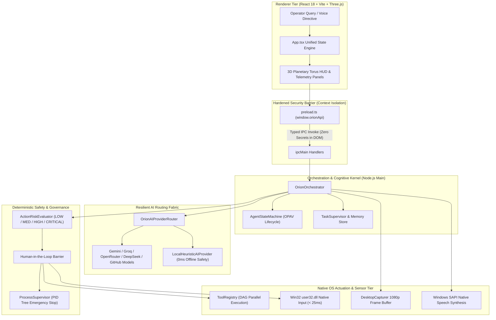

<div align="center">


# Sheikh Saqib

**Founder & Chief Systems Architect &bull; [iMpact](https://impacts-ai.com)**  
*Building [ORION](https://impacts-ai.com/orion) &mdash; an autonomous desktop operating system and kinetic computer-use agent.*

United Arab Emirates &bull; Independent AI Systems &bull; Native Desktop Runtime &bull; Deterministic Governance

<br />

[](https://impacts-ai.com)
[](https://github.com/iMpacts-AI/ORION)
[](https://github.com/iMpacts-AI)
[](https://github.com/iMpacts-AI/ORION)
[](mailto:saqib@impacts-ai.com)

<br />

```
BUILD  →  TEST  →  BREAK  →  FIX  →  SHIP
```

> *"The future of autonomous computing will not take place inside browser chat widgets. It belongs to ambient, desktop-native systems capable of observing, reasoning, and actuating across real operating systems at machine speed."*

<br />

[ [Company Portal](https://impacts-ai.com) ] &bull; [ [Flagship: ORION](https://impacts-ai.com/orion) ] &bull; [ [GitHub Organization](https://github.com/iMpacts-AI) ] &bull; [ [Technical Essays](#-featured-technical-monographs) ] &bull; [ [Verified Benchmarks](#-verified-engineering-benchmarks) ]

---

</div>

## 🔭 Executive Brief

I am an independent systems builder and founder based in the United Arab Emirates. As the founder of **[iMpact](https://impacts-ai.com)**, my work focuses on transitioning artificial intelligence from passive conversational prompts into an actionable computing layer.

Most contemporary agent implementations remain trapped inside sandboxed browser web-wrappers, vulnerable to single-API rate limits, and unequipped with native operating system handles. My engineering discipline centers on building **native desktop agent runtimes**, **sub-25ms kinetic input drivers**, **resilient multi-provider routing fabrics**, and **deterministic safety kernels** that allow machine intelligence to operate safely on host hardware.

---

## ⚡ Currently Building

* **[ORION](https://github.com/iMpacts-AI/ORION):** An autonomous sovereign desktop operating layer that pairs multi-model cognitive reasoning with direct Win32 OS actuation, real-time hardware telemetry, and an optical perception buffer.
* **[iMpact Core](https://github.com/iMpacts-AI/iMpact):** Foundational architectural specifications, kinetic input kernels, and deterministic safety standards governing autonomous desktop execution.
* **[iMpact Control Bridge](https://github.com/iMpacts-AI/impact-discord-hq):** Zero-trust asynchronous control bridge linking remote telemetry, automated test runners, and real-time DuckDuckGo/DOM research synthesis directly into workstation host engines.

---

## 🪐 Flagship Platform: ORION

**Repository:** [`github.com/iMpacts-AI/ORION`](https://github.com/iMpacts-AI/ORION) &bull; **Documentation & Telemetry:** [`impacts-ai.com/orion`](https://impacts-ai.com/orion)

ORION is an agentic desktop operating layer engineered to escape the browser sandbox and interact directly with native software, terminals, filesystems, and desktop environments while preserving total human-in-the-loop governance.

### Architectural Blueprint



### System Implementation Status & Calibration

To maintain absolute engineering integrity, every subsystem is classified into its actual verified state:

| Status | Subsystem | Engineering Details |
| :--- | :--- | :--- |
| **CURRENT** *(Shipped & Verified)* | **Process Tree E-Stop** | Deterministic process termination (`taskkill /T /F /PID`) guaranteeing instant containment upon safety violations. |
| **CURRENT** *(Shipped & Verified)* | **Zero-Leakage IPC** | Chromium sandbox running with `nodeIntegration: false` and `contextIsolation: true`. Cloud keys reside strictly in Node.js Main. |
| **CURRENT** *(Shipped & Verified)* | **Win32 Kinetic Actuation** | Low-latency native input driver injecting mouse and keyboard events directly into the Windows OS kernel. |
| **CURRENT** *(Shipped & Verified)* | **Omnichannel Model Router** | Dynamic speed and quality router hot-swapping between cloud endpoints and zero-cloud local heuristic engines. |
| **CURRENT** *(Shipped & Verified)* | **3D Spatial Telemetry HUD** | Interactive 3D Planetary Torus constructed using Three.js and React 18 for spatial hardware monitoring. |
| **CURRENT** *(Shipped & Verified)* | **Isolated Test Verification** | 35+ subsystem test suites and 50/50 benchmark hardening runs verified in pure process isolation. |
| **IN DEVELOPMENT** | **Closed-Loop Optical Diff** | Pre/post-action optical verification engine comparing pixel diffs to confirm visual UI state changes before marking tasks verified. |
| **IN DEVELOPMENT** | **DAG Tool Parallelization** | Asynchronous execution scheduler dispatching independent read tools concurrently while serializing mutating operations. |
| **IN DEVELOPMENT** | **Continuous Screen Buffer** | 1080p rolling visual perception buffer with grounding models for coordinate mapping. |
| **FUTURE ROADMAP** | **Cross-Application Synthesis** | Autonomous chained workflows bridging disparate native Windows applications without pre-existing APIs. |
| **FUTURE ROADMAP** | **Decentralized Inference Mesh** | Peer-to-peer distribution of local quantized models across LAN workstation nodes. |

---

## 🛠️ Engineering Disciplines & Technical Stack

```
AI & Models          TypeScript (ES2022)  • Python 3.12       • Gemini 3.8 / 2.5 • DeepSeek V3/R1  • Groq LPUs
Desktop Architecture Electron 33          • Node.js 22        • Chromium Sandbox  • IPC Context Bridge • Process Supervision
Native Windows       Win32 API            • user32.dll        • C# Interop        • Windows SAPI TTS   • PID Tree Control
Graphics & Interface React 18             • Vite 6            • Three.js          • Tailwind CSS       • Lucide Icons
Governance & Safety  Deterministic E-Stop • Risk Matrix (4-Tier) • Secret Quarantine (EMP-008) • Isolated Test Harness
```

### Core Technical Competencies

* **Closed-Loop Agent Architecture:** Engineering Observe-Plan-Act-Verify (OPAV) state machines with bounded retry budgets, task memory persistence, and heuristic self-healing.
* **Deterministic Containment:** Architecting safety engines where probabilistic models are barred from evaluating their own risk profiles. High-consequence actions trigger explicit, human-authorized cryptographic gates.
* **Resilient Infrastructure:** Multi-sector API fabrics designed to eliminate single-vendor dependency through dynamic latency scoring, error penalty tracking, and zero-network offline fallbacks.

---

## 📂 Selected Engineering Repositories

### 🌟 [`iMpacts-AI/ORION`](https://github.com/iMpacts-AI/ORION)
> **Autonomous Sovereign Desktop Operating System & Kinetic Computer-Use Agent**
* **Why it matters:** Proves that agentic software can actuate native desktop software safely at sub-25ms latency without ceding architectural control to external closed-source platforms.
* **Stack:** `TypeScript` &bull; `Electron 33` &bull; `React 18` &bull; `Three.js` &bull; `Win32 API` &bull; `Vite`
* **Status:** `Active Flagship` &bull; `v1.0 Baseline Established`

### 🔬 [`iMpacts-AI/iMpact`](https://github.com/iMpacts-AI/iMpact)
> **Sovereign Intelligence Framework & Kinetic Desktop Operating Specifications**
* **Why it matters:** Establishes the underlying protocol, safety contracts, and architectural benchmarks governing how AI agents interface with local operating systems.
* **Stack:** `TypeScript` &bull; `Node.js` &bull; `Systems Engineering`
* **Status:** `Foundation Architecture`

### ⚡ [`iMpacts-AI/impact-discord-hq`](https://github.com/iMpacts-AI/impact-discord-hq)
> **Low-Latency Asynchronous Telemetry & Control Bridge**
* **Why it matters:** Enables real-time workstation telemetry auditing, isolated test suite triggering, DuckDuckGo research synthesis, and live reasoning integration with background keepalives.
* **Stack:** `Python 3.12` &bull; `discord.py` &bull; `BeautifulSoup4` &bull; `DuckDuckGo API` &bull; `AGY Engine`
* **Status:** `Production Live Daemon`

---

## ✍️ Featured Technical Monographs

Long-form architectural monographs exploring desktop agency, safety theory, and distributed inference:

* 📄 **[The Death of the Chatbot Sandbox: Why the Future Belongs to Kinetic Desktop AI](blogs/01-the-death-of-chatbots.md)**  
  *An architectural critique of web-based chat wrappers and an engineering blueprint for sub-25ms native Win32 desktop actuation.*  
  `Systems Architecture` &bull; `6 min read`

* 📄 **[Deterministic Safety Kernels: Governing Autonomous Computer-Use Agents at Machine Speed](blogs/02-deterministic-safety.md)**  
  *Why LLM self-moderation is mathematically flawed, and how to implement zero-trust deterministic risk matrices with process-tree emergency stops.*  
  `Safety & Security` &bull; `5 min read`

* 📄 **[Sovereign Multi-Sector Intelligence: Overcoming the Single-Provider Bottleneck](blogs/03-sovereign-ai-routing.md)**  
  *Designing resilient dynamic inference routing: multi-provider failover mechanics and zero-cloud offline heuristic execution.*  
  `Distributed Systems` &bull; `5 min read`

---

## 📊 Verified Engineering Benchmarks

Data points derived from empirical execution across local testing harnesses and isolated environments:

```
┌────────────────────────────────────────────────────────┬──────────────────────┐
│ Metric / Benchmark Specification                       │ Verified Telemetry   │
├────────────────────────────────────────────────────────┼──────────────────────┤
│ Core ORION Subsystem Test Suites (Process Isolation)   │ 35 / 35 Passed (100%)│
│ Coders HQ Demo Hardening Iterations                    │ 50 / 50 Passed (100%)│
│ Coders HQ Benchmark Average Cycle Latency              │ 889ms                │
│ Native Win32 Cursor & Keystroke Injection Latency      │ < 25ms               │
│ Python Agent End-to-End Test Suite (pytest)            │ 25 / 25 Passed (100%)│
│ EMP-008 Security Scanner (Secret & Key Quarantine)     │ 100% Clean (0 Leaks) │
│ Live Discord Bridge Synchronized Slash Commands        │ 10 Synced Endpoints  │
│ Hardware Telemetry Memory Footprint                    │ Stable across runs   │
└────────────────────────────────────────────────────────┴──────────────────────┘
```

---

## ⚙️ Engineering Principles

1. **Build the system, not the illusion.**  
   A prototype that only functions when everything goes right is not engineering. True agency is measured by how gracefully a system handles rate limits, invalid input, process crashes, and unexpected state drift.

2. **Never ask a neural network to audit its own blast radius.**  
   Probabilistic reasoning is an engine of generation, not governance. Security filters, permission checks, and emergency stops must be written in uncompromising, deterministic code.

3. **Treat permissions as core architecture, not an afterthought.**  
   An agent operating with unrestricted kinetic power is a critical hazard. Every action must carry an explicit risk score (LOW, MEDIUM, HIGH, CRITICAL) and enforce human authorization boundaries.

4. **Multi-sector sovereignty is mandatory.**  
   Relying on a single commercial AI vendor produces brittle systems. Sovereign architectures must dynamically route between providers based on observed latency, throughput, and cost, falling back seamlessly to offline local heuristics when severed from the network.

5. **Verify through telemetry, not assumption.**  
   If an action cannot be verified through an optical diff, an exit code, or a filesystem hash, the system cannot assert completion. Trust is an output of verification.

---

## 👤 About Sheikh Saqib

I am 13 years old, living and building in the United Arab Emirates. 

I began building software early because I wanted to understand how computers behave at the deepest practical level. My focus is not on trivial experiments or novelty projects; I spend my time designing and shipping real architectures: native desktop runtimes, autonomous agents, and deterministic safety systems.

Being 13 is context, not my qualification. I measure my work by code quality, test suite rigor, architectural depth, and system reliability. My goal is to build **[iMpact](https://impacts-ai.com)** into an enduring, sovereign technology company that creates the actionable operating layer for artificial general intelligence.

---

## 🗺️ Roadmap: Execution Trajectory

```
NOW     [Active]     • Solidify ORION v1.0 desktop engine stability and packaging
                     • Expand optical verification diff testing on diverse Windows UI targets
                     • Harden multi-model failover routing across edge network conditions

NEXT    [Q1/Q2]      • Launch developer SDK for custom ORION tool definition
                     • Implement continuous rolling visual perception buffer with local grounding
                     • Release standalone native Windows portable distribution

LATER   [Long-Term]  • Ambient, zero-latency system-level autonomous execution
                     • Multi-agent collaborative workflows across localized workstation clusters
                     • Decentralized peer-to-peer inference mesh for sovereign local compute
```

---

## 🌐 Official Portals & Direct Communication

Inquiries regarding technical architecture, collaboration, or institutional research:

* **Official Enterprise Portal:** [impacts-ai.com](https://impacts-ai.com)
* **Flagship Project:** [impacts-ai.com/orion](https://impacts-ai.com/orion)
* **GitHub Organization:** [github.com/iMpacts-AI](https://github.com/iMpacts-AI)
* **Flagship Repository:** [github.com/iMpacts-AI/ORION](https://github.com/iMpacts-AI/ORION)
* **Direct Email:** [saqib@impacts-ai.com](mailto:saqib@impacts-ai.com)
* **LinkedIn:** [linkedin.com/in/impact-ai](https://www.linkedin.com/in/impact-ai)
* **Instagram:** [@impacts_ai](https://www.instagram.com/impacts_ai)
* **YouTube:** [iMpact AI Channel](https://www.youtube.com/channel/UCGHBVNRNwYRRfY02yQqemPQ)

<br />

<div align="center">

<sub>Designed, engineered, and maintained by <b>Sheikh Saqib</b> &bull; Founder of <b>iMpact</b> &bull; Built in the United Arab Emirates</sub>

</div>
