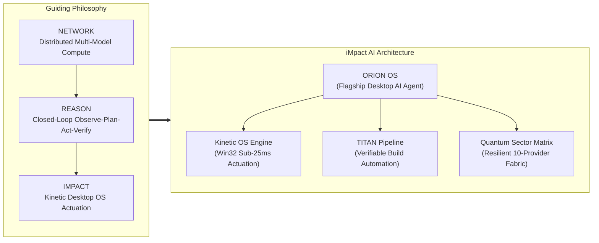

# Sheikh Mohammed Saqib
### *Founder & Chief AI Systems Architect — iMpact AI*

 

> ### **NETWORK • REASON • IMPACT**
> *"The future of artificial intelligence does not belong inside sandboxed browser tabs. It belongs to ambient, sovereign desktop operating systems capable of perceiving, reasoning, and acting directly across native computational environments."*

---

## 🌌 Executive Overview

I am **Sheikh Mohammed Saqib**, an independent AI systems engineer and the founder of **[iMpact AI](https://github.com/iMpacts-AI)**. 

My engineering discipline focuses on the frontier of **sovereign autonomous agents**, **kinetic computer-use systems**, and **deterministic safety architectures**. Rather than building reactive chatbots confined to chat windows, I design and build production-grade AI platforms that interface directly with operating system kernels, manipulate kinetic desktop inputs with millisecond precision, and execute complex autonomous workflows under deterministic safety constraints.

---

## 🏛️ Core Principles & Architecture

### 1. Kinetic Desktop Control
Computing power is wasted when AI cannot interact with real desktop software. Through native Win32 drivers (`user32.dll`), high-frequency optical frame perception (1080p capture), and structured keyboard/mouse dispatchers, my systems achieve verified sub-25ms desktop actuation.

### 2. Omnichannel Neural Resilience
Single-provider dependency is a fatal architecture flaw. My platforms implement sovereign routing fabrics connecting over 10 model providers (OpenRouter, Groq, Gemini, GitHub Models, DeepSeek, plus offline heuristic engines) with dynamic fallback and automated failover.

### 3. Deterministic Safety & Governance
Autonomous agency requires non-negotiable boundaries. Every action is evaluated across a deterministic risk matrix (`LOW`, `MEDIUM`, `HIGH`, `CRITICAL`), guarded by human authorization gates, and backed by instantaneous process-tree emergency kills (`taskkill /T /F /PID`).

---

## 🚀 Flagship Creations

### 🌟 [ORION // Autonomous Desktop AI Operating System](https://github.com/iMpacts-AI/ORION)
* **What it is:** The premier autonomous AI desktop operating system built for Windows.
* **Key Innovations:**
  * **3D Planetary Torus HUD:** Immersive spatial status interface engineered in Three.js and React 18.
  * **Kinetic Computer-Use:** Native mouse movement, window manipulation, file exploration, and app automation.
  * **Zero-Leakage Security Boundary:** Hardened Chromium sandbox with context isolation separating cloud credentials from UI rendering.
  * **Closed-Loop DAG Execution:** Multi-tool dependency graphs executing parallel read operations and sequential write mutations.

### ⚡ [iMpact // Sovereign Intelligence Ecosystem](https://github.com/iMpacts-AI/iMpact)
* **What it is:** The foundational framework and umbrella architecture powering the iMpact ecosystem.
* **Core Modules:**
  * **Kinetic OS Engine:** Sub-25ms native input layer.
  * **TITAN Pipeline:** Continuous asset inspection, quality scoring, and automated release validation.
  * **Quantum Sector Matrix:** Sovereign multi-model routing fabric.

---

## 🛠️ Technical Competencies & Arsenal

| Domain | Technologies & Frameworks |
| :--- | :--- |
| **Agentic AI & Orchestration** | Observe-Plan-Act-Verify loops, Tool Execution DAGs, Multimodal Vision, Cognitive Memory Stores |
| **Desktop Systems & Runtimes** | Electron 33, Node.js (Main Process Architecture), Context Bridge IPC Isolation |
| **Native Windows Engineering** | Win32 API (`user32.dll`), C# Native Input Drivers, Windows SAPI TTS, Process Tree Supervision |
| **Frontend & Visualization** | TypeScript 5.7, React 18, Three.js, Vite 6, Tailwind CSS, Lucide Icons |
| **Model Integration** | OpenRouter, Groq, Google Gemini, GitHub Models, DeepSeek, Local Heuristic Fallbacks |
| **Security & Quality** | Deterministic Risk Governance, Secret Isolation, Empirical Test Automation (100% Pass Suites) |

---

## 🌐 Connect & Collaborate

I actively collaborate with engineers, researchers, and organizations pushing the limits of computer-use agents, ambient AI, and autonomous operating systems.

* **GitHub (Organization):** [github.com/iMpacts-AI](https://github.com/iMpacts-AI)
* **Website:** [impacts-ai.com](https://impacts-ai.com)
* **LinkedIn:** [linkedin.com/in/impact-ai](https://www.linkedin.com/in/impact-ai)
* **Instagram:** [@impacts_ai](https://www.instagram.com/impacts_ai)
* **YouTube:** [iMpact AI Official Channel](https://www.youtube.com/channel/UCGHBVNRNwYRRfY02yQqemPQ)

---

Built with sovereign intent by <b>Sheikh Mohammed Saqib</b> &bull; Founder of <b>iMpact AI</b>

